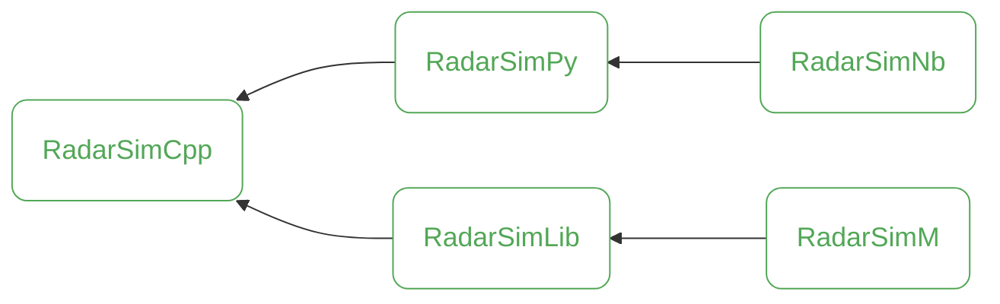

# RadarSimNb

`RadarSimNb` is a repository containing Jupyter Notebooks that provide detailed, hands-on examples for using `RadarSimPy`. These notebooks serve as a practical guide to help you get started quickly and effectively. Explore the [examples](https://radarsimx.com/category/examples/) to dive in!

